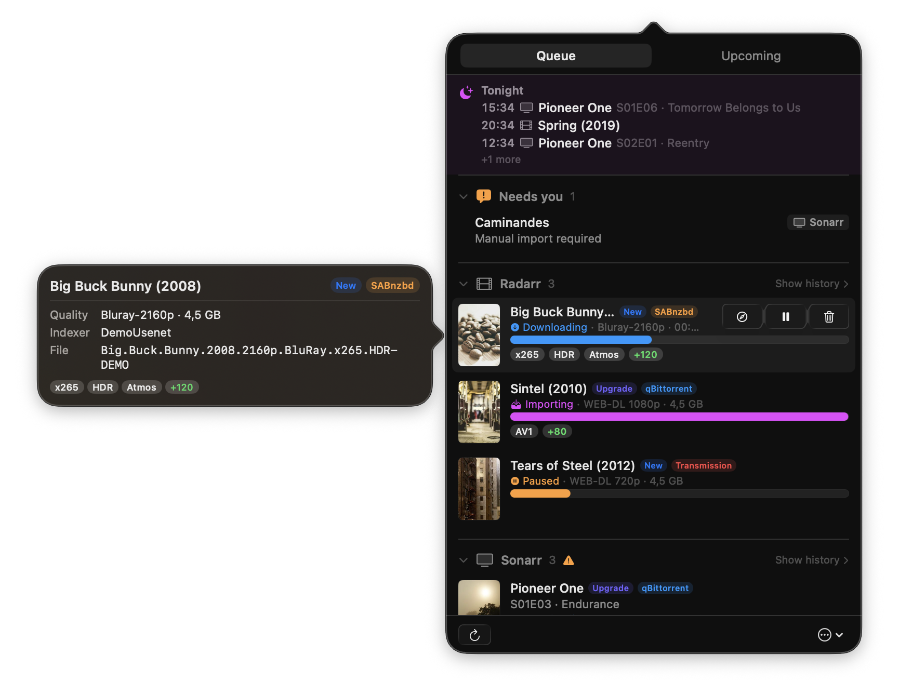

# ArrBarr

A lightweight macOS menu bar app for monitoring your Radarr and Sonarr download queues, upcoming media, and controlling SABnzbd/qBittorrent download clients.




## Features

- **Queue monitoring** — View active downloads from Radarr and Sonarr in a unified popover
- **Upcoming media** — Browse upcoming TV episodes and movie releases with calendar grouping
- **Download controls** — Pause, resume, and remove downloads directly from the menu bar
- **Client support** — SABnzbd (Usenet) and qBittorrent (Torrent) integration
- **Status bar badge** — Shows active download count with a live-updating icon
- **Right-click menu** — Quick access to refresh, settings, and quit
- **Open in browser** — Jump to any item's Radarr/Sonarr web page
- **Liquid Glass** — Native macOS 26 (Tahoe) glass effects with graceful fallback
- **Configurable polling** — Adjustable refresh intervals, including "Never" for manual refresh

## Installation

### Homebrew

```bash
brew tap Preclowski/arrbarr
brew install --cask arrbarr
```

### Download

Download the latest `.dmg` from [Releases](../../releases) and drag ArrBarr to your Applications folder.

### Build from source

Requires Xcode 26+.

```bash
open ArrBarr.xcodeproj
# Build with ⌘B, Run with ⌘R
```

## Setup

1. Click the arrow icon in the menu bar
2. Open **Settings** (gear menu or right-click the icon)
3. Enter your service URLs and API keys:
   - **Radarr** / **Sonarr** — Base URL + API key (found in Settings > General in each app)
   - **SABnzbd** — Base URL + API key (for Usenet download control)
   - **qBittorrent** — Base URL + username/password (for Torrent download control)

All connections go through your local network. ArrBarr is sandboxed with network-client-only permissions.

## Architecture

```
┌──────────────────┐    info + custom formats     ┌─────────────┐
│  Radarr/Sonarr   │ ───────────────────────────▶ │   ArrBarr   │
└──────────────────┘                              │  (popover)  │
                                                  └──────┬──────┘
┌──────────────────┐    start / pause / delete           │
│ SABnzbd/qBitt.   │ ◀───────────────────────────────────┘
└──────────────────┘
```

- **Swift 6** with strict concurrency (`@MainActor`, `actor` isolation)
- **SwiftUI** popover and settings, **AppKit** status bar and window management
- **No dependencies** — pure Foundation networking, no third-party libraries

```
ArrBarr/
├── Models/          # QueueItem, UpcomingItem, ServiceConfig, API types
├── Services/        # HTTP client, Radarr/Sonarr/SABnzbd/qBittorrent clients
├── ViewModels/      # QueueViewModel with optimistic updates
└── Views/           # PopoverContentView, QueueRowView, SettingsView
```

## Vibe-coded

This project was built entirely through [vibe coding](https://en.wikipedia.org/wiki/Vibe_coding) with [Claude Code](https://claude.ai/claude-code).

## License

[MIT](LICENSE)
