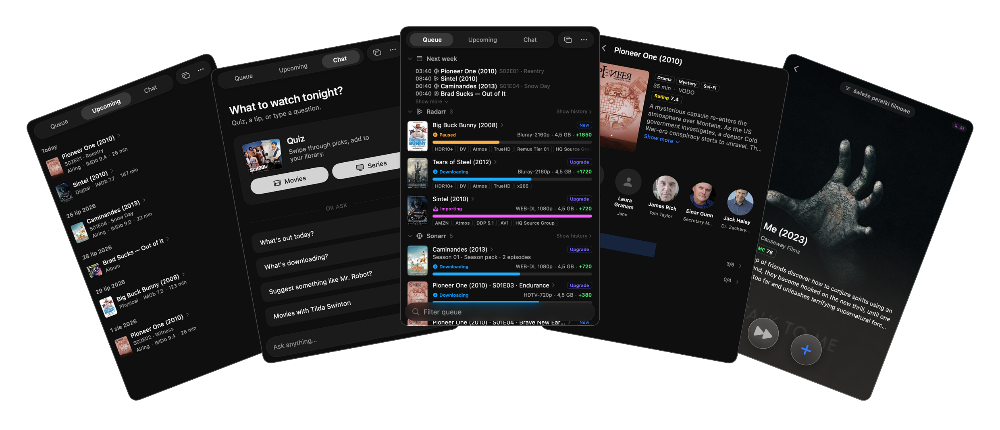

# ArrBarr

**Your whole \*arr stack, one glance away — right from the menu bar.**

A native macOS menu-bar app (plus an iOS companion and widgets) for Radarr,
Sonarr, Lidarr and Whisparr. Watch your queues, see what's coming up, and pause,
resume or delete downloads — without opening a single browser tab.

[](https://github.com/Preclowski/ArrBarr/actions/workflows/release.yml)


<p align="center">
  <b><a href="https://arrbarr.app">arrbarr.app</a></b>
  &nbsp;·&nbsp; <a href="../../releases">Download</a>
  &nbsp;·&nbsp; <a href="#install">Install</a>
  &nbsp;·&nbsp; <a href="#works-with-your-stack">Compatibility</a>
</p>

<p align="center">
  
</p>

You've got Radarr, Sonarr, Lidarr and a couple of download clients humming away
on your server. Checking on a grab shouldn't mean opening four web UIs. ArrBarr
puts the whole stack behind one menu-bar icon: glance at the queue, catch what's
airing this week, get pinged when a release lands, and act on it in one click.

It's **100% local** — it talks straight to your servers, with no cloud, no
account and no telemetry in between. It's **native** (SwiftUI + AppKit, ~58 MB
installed — not another Electron tab pretending to be an app). And it's **free
and open source**, with every feature unlocked.

## Features

- **Live queue at a glance** — every arr in one view, with posters, progress
  bars, quality chips and scores. Season packs collapse into a single row.
- **Drive your downloads** — pause, resume, delete or start-now, right from the
  popover. Routed through the arr, so it works with *any* download client.
- **Upcoming calendar** — movies, episodes and album releases grouped by date,
  so you always know what's landing this week.
- **Search & add** — look a title up across every arr at once, pick quality
  profile and root folder, and add it.
- **Grab notifications & history** — native alerts when a release is grabbed,
  plus the last 50 events per arr (grabbed / imported / failed / deleted).
- **Rich hover cards** — quality, size, score, custom formats, indexer and
  release name. Upgrades show a side-by-side with the file you already have, so
  you can tell at a glance whether it's actually better.
- **AI chat** *(optional)* — run your stack in plain language: *"what's stuck in
  the queue?"*, *"add the new season of X"*, *"what's out this week?"*
- **Quiz** *(optional)* — swipe-to-discover new titles, cross-referenced against
  your library so you're never shown things you already own.
- **Live & resilient** — real-time updates over each arr's SignalR feed, a
  forced reconnect when your Mac wakes, and a quiet offline chip (not a wall of
  errors) when you're away from the LAN.
- **Localized** — English, German, Spanish, French, Dutch and Polish.

## Works with your stack

- **Media managers** — Radarr · Sonarr · Lidarr · Whisparr
- **Usenet** — SABnzbd · NZBGet
- **Torrent** — qBittorrent · Transmission · rTorrent · Deluge
- **AI chat** — Apple Intelligence · any OpenAI-compatible API (OpenRouter, Ollama, local models)
- **MCP clients** — ChatGPT · Claude · any MCP-capable app, via ArrBarr's built-in [MCP](https://modelcontextprotocol.io) server

> Whisparr is adult content, so it stays hidden until you confirm your age in
> Settings — and its posters can be blurred.

## Install

### Homebrew

```bash
brew tap Preclowski/arrbarr
brew install --cask arrbarr
```

### Download

Grab the latest `.dmg` from [Releases](../../releases) and drag ArrBarr into
Applications.

> **Heads up:** ArrBarr isn't notarized (no paid Apple Developer account), so
> Gatekeeper may block the first launch. Right-click the app and choose
> **Open**, and macOS will remember. If it still won't budge:
> ```bash
> xattr -cr /Applications/ArrBarr.app
> ```

<details>
<summary>Build from source</summary>

Requires Xcode 26.4.1 (the version CI pins) and macOS 14+.

```bash
open ArrBarr.xcodeproj   # ⌘B to build, ⌘R to run
```

or from the command line:

```bash
xcodebuild -project ArrBarr.xcodeproj -scheme ArrBarr -configuration Debug \
  -derivedDataPath build build
```

The project ships with an **empty signing team** so forks build ad-hoc out of
the box. To sign with your own, pass `ARRBARR_DEVELOPMENT_TEAM=YOURTEAMID` to
`xcodebuild` (or set it in Xcode) rather than editing `DEVELOPMENT_TEAM`.
</details>

## First run

1. Click the menu-bar icon and open **Settings** (⌘,).
2. Add the URL + API key for each *arr you run.
3. Add credentials for any download clients you want to control — done.

Every connection goes straight to your own servers. The macOS app is sandboxed;
it needs outgoing network access for the arrs, and incoming only if you turn on
the MCP server (below).

## Privacy & security

- **No middleman.** Nothing is proxied through a service of ours, because there
  isn't one. No account, no analytics, no phone-home.
- **Your keys stay on your machine.** *arr API keys, download-client passwords
  and any OpenAI/TMDB keys live in the Keychain (signed builds) or a
  sandboxed-container plist (everything else). App Store builds can optionally
  sync settings and secrets through iCloud. See [SECURITY.md](SECURITY.md) for
  the full threat model.
- **Age-gated where it counts.** Whisparr is hidden and its posters blurrable.

## AI chat, Quiz & MCP server

All optional, all off until you flip them on.

- **Chat** runs against **Apple Intelligence** (Foundation Models, on supported
  hardware) or any **OpenAI-compatible API** — OpenRouter, Ollama, a local
  server, whatever you point it at. Destructive actions are always confirmed
  first.
- **Quiz** pulls TMDB suggestions and filters out anything already in your
  library. (TMDB and the OpenAI path each need your own key.)
- **MCP server** — ArrBarr embeds a [Model Context
  Protocol](https://modelcontextprotocol.io) server, so **ChatGPT, Claude or any
  other MCP client** can drive your stack with the same arr tool catalog the
  in-app chat uses. It's **off by default** and locked down when on: binds
  `127.0.0.1` only, requires a bearer token for any non-loopback address,
  validates `Origin`, and lets you toggle every tool individually.

## Made for macOS

- **Menu bar first** — lives behind one icon; optionally a full Dock app in a
  detached window. Light and dark follow the system, with Liquid Glass on
  macOS 26 (Tahoe) and a graceful fallback on macOS 14+.
- **Siri & Shortcuts** — six App Intents (show queue, show upcoming, pause all,
  resume all, search to add, check arr health) you can run by voice or wire into
  your own Shortcuts.
- **Spotlight** — those same actions are searchable straight from Spotlight.
- **Native notifications** the moment a release is grabbed.
- **Keyboard shortcuts** — **⌘,** Settings · **⌘N** Add · **⌘R** Refresh ·
  **⌘Q** Quit.

Want to explore the UI without wiring up real servers? Launch demo mode — it
uses an isolated preferences suite and never touches your real config:

```bash
open /Applications/ArrBarr.app --args --demo
```

## Also on iOS

The same core ships as an iOS companion (queue, calendar, search, detail and
chat) plus **WidgetKit** widgets — per-service library counts, a status grid and
an Up Next glance. Almost all the code lives in a shared Swift package, so the
apps stay in lockstep.

## Docs

- [CHANGELOG.md](CHANGELOG.md) — what changed, per release
- [CONTRIBUTING.md](CONTRIBUTING.md) — build, test and send a change
- [SECURITY.md](SECURITY.md) — reporting a vulnerability, and the threat model
- [THIRD-PARTY-LICENSES.md](THIRD-PARTY-LICENSES.md) — dependency attribution

> **Note:** "Control" is a paid tier on the App Store (chat, download-client
> management, adding titles, queue actions). The build in this repo and the DMG
> on Releases contain **no payment code at all** and are fully unlocked — the
> paywall is compiled in only for App Store builds.

## License

[MIT](LICENSE) © preclowski
