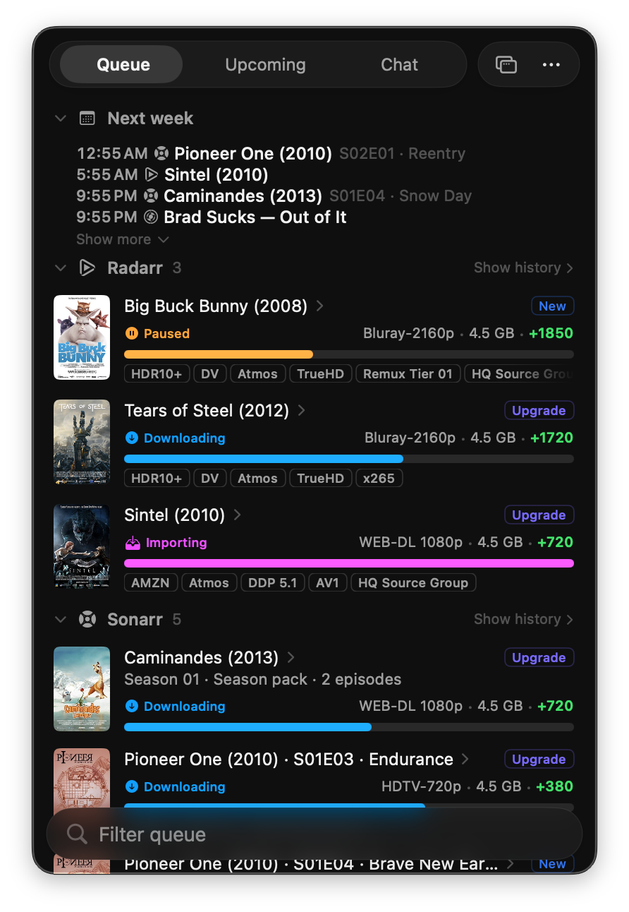

# ArrBarr

A native macOS menu-bar app — plus an iOS companion and iOS widgets — for
watching your Radarr, Sonarr, Lidarr and Whisparr queues, browsing what's
coming up, and driving your download clients without opening a browser tab.

[](https://github.com/Preclowski/ArrBarr/actions/workflows/release.yml)


ArrBarr isn't a replacement for the *arr web UIs — it's a companion you keep in
your menu bar. Glance at the queue, see what's airing this week, get notified
when a release is grabbed, and act on it in one click. Available in English,
German, Spanish, French, Dutch and Polish.

<p align="center">
  
</p>

## Highlights

- **Rich hover tooltip** with quality, size, score, custom-format chips, indexer
  and release name. For upgrades, a side-by-side comparison with the existing
  file (quality, score, formats, size, filename) so you can tell at a glance
  whether the upgrade is actually better.
- **In-popover history** — last 50 events per arr (grabbed / imported / failed /
  deleted), each with its own icon, colour and relative time.
- **Pause / resume / delete / start-now** without leaving the menu bar. These
  work for *any* download client, because the command is routed through the arr.
- **Upcoming calendar** — movies, episodes and album releases grouped by date.
- **Search and add** — look up a title across every configured arr at once, pick
  quality profile and root folder, and add it.
- **Season-aware queue** — multi-episode packs collapse into one row, whether
  they share a download ID or are separate grabs.
- **Live updates** over each arr's SignalR/WebSocket feed, with a forced
  reconnect after the Mac wakes.
- **Quiet when you're away** — off the LAN, ArrBarr shows a small offline chip
  instead of a wall of connection errors.
- **Native** — SwiftUI + AppKit, ~58 MB installed. Light and dark mode follow
  the system, with Liquid Glass on macOS 26 (Tahoe) and a graceful fallback on
  macOS 14+.

## Three apps, one core

| Target | What it is |
| --- | --- |
| **ArrBarr** | The macOS menu-bar app. Optionally also a regular Dock app in a detached window. |
| **ArrBarriOS** | The iOS companion — the same queue, calendar, search, detail and chat surfaces. |
| **ArrBarrWidgets** | iOS WidgetKit widgets: per-service library counts (small), a status grid (medium), and Up Next (small + medium). |

Almost all of the code lives in the `ArrCore` Swift package that all three
import; the app targets are thin shells. A second package, `ArrMCPServer`, hosts
the MCP server.

## Supported services

- **Media managers** — Radarr, Sonarr, Lidarr, Whisparr
- **Usenet** — SABnzbd, NZBGet
- **Torrent** — qBittorrent, Transmission, rTorrent, Deluge

Whisparr is adult content, so it stays hidden until you confirm your age in
Settings, and its posters can be blurred.

## AI chat and Quiz

- **Chat** drives your whole stack in plain language — "what's stuck in the
  queue", "add the new season of X", "what's out this week". It runs against
  either **Apple Intelligence** (Foundation Models, on supported hardware) or
  any **OpenAI-compatible API** you point it at, including OpenRouter and a
  local server. Destructive actions are always confirmed before they run.
- **Quiz** is swipe-to-discover: TMDB suggestions cross-referenced against your
  library, so you only get shown things you don't already have. Tap something
  you own and it opens the normal detail view.

Both are optional and off until you enable them. TMDB features need your own
TMDB key; the OpenAI path needs your own API key.

## MCP server

ArrBarr embeds an [MCP](https://modelcontextprotocol.io) server, so external LLM
clients get the same arr tool catalog the in-app chat uses — library lookups,
calendar, queue, health, search-and-add, TMDB discovery.

It is **off by default**, and secure by default when you turn it on:

- binds `127.0.0.1:8080` unless you change it
- bearer-token authentication is on by default, and the server **refuses to bind
  a non-loopback address without it**
- `Origin` is validated, so a web page can't drive it through your browser
- every tool can be individually disabled in Settings
- the bearer token is device-only and never syncs

## Installation

### Homebrew

```bash
brew tap Preclowski/arrbarr
brew install --cask arrbarr
```

### Download

Grab the latest `.dmg` from [Releases](../../releases) and drag ArrBarr to your
Applications folder. The DMG also carries `LICENSE.txt` and
`THIRD-PARTY-LICENSES.md`.

> **Note:** ArrBarr is not notarized (no paid Apple Developer account), so
> Gatekeeper may block the first launch. Right-click the app and choose "Open" —
> macOS asks once, then remembers. If that doesn't work:
> ```bash
> xattr -cr /Applications/ArrBarr.app
> ```

### Build from source

Requires Xcode 26.4.1 (the version CI pins) and macOS 14+.

```bash
open ArrBarr.xcodeproj
# Build with ⌘B, Run with ⌘R
```

or from the command line:

```bash
xcodebuild -project ArrBarr.xcodeproj -scheme ArrBarr -configuration Debug \
  -derivedDataPath build build
```

The project ships with an **empty signing team** so forks build ad-hoc out of
the box. To sign with your own team, pass `ARRBARR_DEVELOPMENT_TEAM=YOURTEAMID`
to `xcodebuild` (or set it in Xcode's build settings) rather than editing
`DEVELOPMENT_TEAM` directly.

## Setup

1. Click the arrow icon in the menu bar
2. Open **Settings** (gear menu, right-click the icon, or ⌘,)
3. Add the URL + API key for each *arr, plus credentials for any download client
   you want to control

Every connection is direct to your own servers. Nothing is proxied through a
service of ours, because there isn't one. The macOS app is sandboxed; it needs
outgoing network access for the arrs, and incoming only if you enable the MCP
server.

### Where your credentials live

ArrBarr stores *arr API keys, download-client passwords and your OpenAI/TMDB
keys in one of two places, decided at runtime by what the build's **code
signature** actually provisions:

| Build | Store |
| --- | --- |
| Signed with a real team identity that provisions the shared Keychain access group (the App Store build) | the system **Keychain** |
| Everything else — local Debug builds, the self-signed DMG from Releases, forks signed by another team | a plist inside the app's **sandboxed container** |

The fallback exists because the restricted `keychain-access-groups` entitlement
needs a provisioning profile Apple has to issue, which an ad-hoc signature can
never have. A build that later gains a provisioned profile migrates its secrets
into the Keychain on first launch. Either way the data stays on your machine —
but the container plist is not encrypted at rest beyond FileVault, so treat a
shared or unencrypted Mac accordingly.

### iCloud sync

App Store builds can mirror settings through iCloud key-value storage and sync
secrets through iCloud Keychain, toggleable in Settings. The MCP bearer token is
deliberately excluded — it gates a server bound to one machine. iCloud sync is
not available in the OSS build, which has no iCloud entitlements.

## Siri, Shortcuts and Spotlight

Six App Intents are exposed, so you can run them by voice, from Shortcuts, or
straight from Spotlight: show the download queue, show upcoming, pause all
downloads, resume all downloads, search for a title to add, and check arr health.

## Keyboard shortcuts

- **⌘,** — Open Settings
- **⌘N** — Add a title
- **⌘R** — Refresh queue (status menu)
- **⌘Q** — Quit ArrBarr

## Demo mode

Want to see the UI without configuring real services? Demo mode uses an isolated
preferences suite, so your real configuration is never touched.

```bash
open /Applications/ArrBarr.app --args --demo
```

## Dependencies

ArrBarr is not dependency-free. Nine open-source Swift packages are linked into
the shipped app:

| Package | Why |
| --- | --- |
| [swift-nio](https://github.com/apple/swift-nio) | HTTP host for the MCP server |
| [mcp-swift-sdk](https://github.com/modelcontextprotocol/swift-sdk) | MCP protocol types and routing |
| [swift-log](https://github.com/apple/swift-log) | logging façade used by the SDK and NIO, bridged to `os.Logger` |
| [swift-markdown](https://github.com/swiftlang/swift-markdown) | renders assistant chat messages |
| [swift-cmark](https://github.com/swiftlang/swift-cmark) | cmark-gfm, via swift-markdown |
| [eventsource](https://github.com/mattt/eventsource) | server-sent events for realtime updates |
| swift-atomics, swift-collections, swift-system | transitive dependencies of SwiftNIO |

All of them are pinned to exact versions in the tracked `Package.resolved`
files, so a release DMG is reproducible from its tag. Their license terms and
required notices are in [THIRD-PARTY-LICENSES.md](THIRD-PARTY-LICENSES.md).

## Control

"Control" is the paid tier on the App Store, covering chat, download-client
management, adding titles and queue actions. **The build in this repository and
the DMG on Releases contain no payment code at all and are fully unlocked** —
the paywall is compiled in only for App Store builds.

## Project docs

- [CHANGELOG.md](CHANGELOG.md) — what changed, per release
- [CONTRIBUTING.md](CONTRIBUTING.md) — how to build, test and send a change
- [SECURITY.md](SECURITY.md) — reporting a vulnerability, and the app's threat model
- [THIRD-PARTY-LICENSES.md](THIRD-PARTY-LICENSES.md) — dependency attribution

## Vibe-coded

This project was built entirely through
[vibe coding](https://en.wikipedia.org/wiki/Vibe_coding) with
[Claude Code](https://claude.ai/claude-code).

## License

[MIT](LICENSE) © Konrad Preclowski
